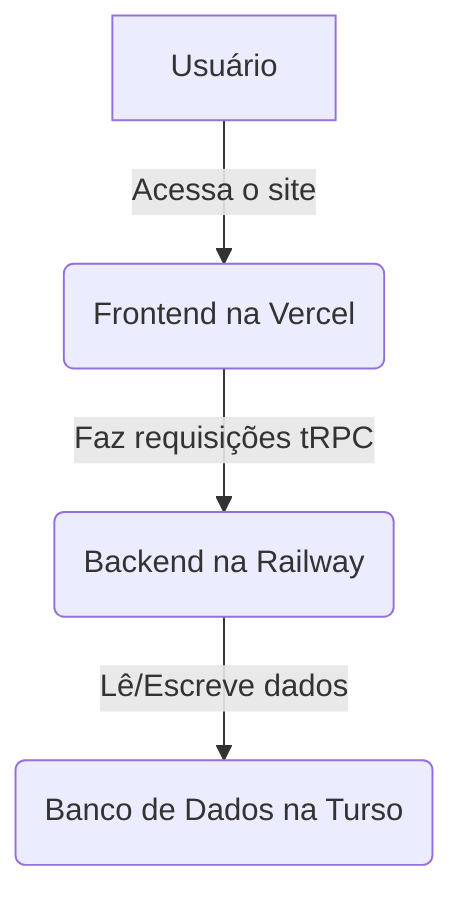

# 🚀 Guia de Deploy em Produção - HZ Soluções

## Visão Geral

Este guia explica como fazer o deploy do projeto **HZ Soluções** em um ambiente de produção online, permitindo que você e sua esposa acessem o sistema de qualquer lugar. Usaremos os seguintes serviços, que possuem excelentes planos gratuitos:

- **Frontend (Web):** [Vercel](https://vercel.com)
- **Backend (Server):** [Railway](https://railway.app)
- **Banco de Dados:** [Turso](https://turso.tech) (para LibSQL)

## Pré-requisitos

Antes de começar, você precisará de:

1.  **Conta no GitHub:** Onde seu código está hospedado.
2.  **Conta na Vercel:** Crie uma conta usando seu perfil do GitHub.
3.  **Conta na Railway:** Crie uma conta usando seu perfil do GitHub.
4.  **Conta na Turso:** Crie uma conta usando seu perfil do GitHub.

## 🗺️ Arquitetura de Produção

O sistema funcionará da seguinte forma:



---

## Passo 1: Configurar o Banco de Dados (Turso)

O backend precisa de um banco de dados para armazenar as informações. Usaremos o Turso, que é compatível com o Drizzle e o LibSQL.

### 1.1. Instale a CLI do Turso

No seu computador local, abra o terminal e instale a ferramenta de linha de comando do Turso:

```bash
# macOS/Linux
curl -sSfL https://get.tur.so/install.sh | bash

# Windows (via PowerShell)
iwr https://get.tur.so/install.ps1 -useb | iex
```

### 1.2. Faça login no Turso

```bash
turso auth login
```

Isso abrirá uma janela no navegador para você autorizar com sua conta do GitHub.

### 1.3. Crie um novo banco de dados

Escolha um nome para o seu banco (ex: `hz-solucoes-db`) e uma região próxima a você (ex: `gru` para São Paulo).

```bash
turso db create hz-solucoes-db --region gru
```

### 1.4. Obtenha a URL do banco

```bash
turso db show hz-solucoes-db
```

Copie a **URL** que começa com `libsql://...`. Guarde-a para o próximo passo.

### 1.5. Crie um token de autenticação

```bash
turso db tokens create hz-solucoes-db
```

Copie o **token** que será exibido. **Guarde este token em um local seguro**, pois ele não será mostrado novamente.

---

## Passo 2: Fazer o Deploy do Backend (Railway)

O Railway irá hospedar nosso servidor Node.js.

### 2.1. Crie um novo projeto na Railway

1.  Acesse seu [Dashboard na Railway](https://railway.app/dashboard).
2.  Clique em **New Project**.
3.  Selecione **Deploy from GitHub repo**.
4.  Escolha o repositório `hzsolocoes1983-ui/hzsolucoes`.

### 2.2. Configure o serviço

O Railway detectará automaticamente o monorepo e perguntará qual serviço você quer criar.

1.  Clique em **Add a service**.
2.  O Railway pode não detectar o `Dockerfile` automaticamente. Se isso acontecer, configure manualmente:
    - **Root Directory:** `hz-solucoes/apps/server`
    - **Build Command:** Deixe em branco (usará o Dockerfile)
    - **Start Command:** Deixe em branco (usará o `CMD` do Dockerfile)

### 2.3. Configure as Variáveis de Ambiente

Esta é a parte mais importante. Na aba **Variables** do seu serviço na Railway, adicione as seguintes variáveis:

| Variável | Valor |
| :--- | :--- |
| `PORT` | `3000` (O Railway substituirá pela porta correta automaticamente) |
| `DATABASE_URL` | A **URL do Turso** que você copiou (ex: `libsql://...`) |
| `DATABASE_AUTH_TOKEN` | O **token do Turso** que você copiou |
| `JWT_SECRET` | Crie uma senha longa e segura. Use um gerador de senhas. |
| `CORS_ORIGIN` | Deixe em branco por enquanto. Vamos preencher no próximo passo. |

### 2.4. Gere um domínio público

Na aba **Settings** do seu serviço, clique em **Generate Domain**. O Railway criará uma URL pública para o seu backend (ex: `https://hz-server-production.up.railway.app`).

**Copie esta URL.**

---

## Passo 3: Fazer o Deploy do Frontend (Vercel)

Agora vamos colocar o site no ar.

### 3.1. Crie um novo projeto na Vercel

1.  Acesse seu [Dashboard na Vercel](https://vercel.com/dashboard).
2.  Clique em **Add New...** > **Project**.
3.  Selecione o repositório `hzsolocoes1983-ui/hzsolucoes`.

### 3.2. Configure o projeto

A Vercel é excelente em detectar a configuração correta, mas vamos garantir:

1.  Em **Root Directory**, clique em **Edit** e selecione `hz-solucoes/apps/web`.
2.  A Vercel deve detectar que é um projeto **Vite**.

### 3.3. Configure as Variáveis de Ambiente

Na seção **Environment Variables**, adicione a seguinte variável:

| Variável | Valor |
| :--- | :--- |
| `VITE_TRPC_URL` | A **URL do backend da Railway** que você copiou, seguida de `/trpc`. Ex: `https://hz-server-production.up.railway.app/trpc` |

### 3.4. Faça o Deploy

Clique em **Deploy**. A Vercel fará o build e o deploy do seu frontend. Ao final, você receberá a URL do seu site (ex: `https://hz-solucoes.vercel.app`).

---

## Passo 4: Configuração Final e Testes

Estamos quase lá! Só falta um detalhe.

### 4.1. Atualize a variável `CORS_ORIGIN`

1.  Volte para o seu projeto na **Railway**.
2.  Na aba **Variables**, edite a variável `CORS_ORIGIN`.
3.  Cole a **URL do seu site na Vercel** (ex: `https://hz-solucoes.vercel.app`).

Isso garantirá que apenas o seu frontend possa fazer requisições para o seu backend, por segurança.

### 4.2. Execute a Migração de Senhas no Ambiente de Produção

**IMPORTANTE:** Como o banco de dados de produção é novo, você precisa executar a migração de senhas para criar o usuário padrão.

1.  Na **Railway**, vá para a aba **Deployments** do seu serviço.
2.  Clique no último deploy bem-sucedido.
3.  No menu à direita, clique em **Redeploy**.

Após o redeploy, o servidor deve iniciar e o `loginGuest` funcionará corretamente.

### 4.3. Teste a Aplicação

1.  Acesse a URL do seu site na Vercel.
2.  Clique em **Acessar**.
3.  Se tudo deu certo, você será redirecionado para o Dashboard!

## 🔍 Troubleshooting

- **Erro 500 no login:** Verifique se as variáveis `DATABASE_URL` e `DATABASE_AUTH_TOKEN` na Railway estão corretas.
- **Frontend não carrega dados:** Verifique se a variável `VITE_TRPC_URL` na Vercel está correta e se a `CORS_ORIGIN` na Railway está configurada com a URL da Vercel.
- **Ver logs:** Tanto a Vercel quanto a Railway possuem abas de **Logs** em tempo real. Verifique-os para encontrar a causa de qualquer erro.

## 🎉 Parabéns!

Seu projeto está agora 100% online e pronto para ser usado por você e sua esposa. Lembre-se de guardar as URLs e as variáveis de ambiente em um local seguro.
